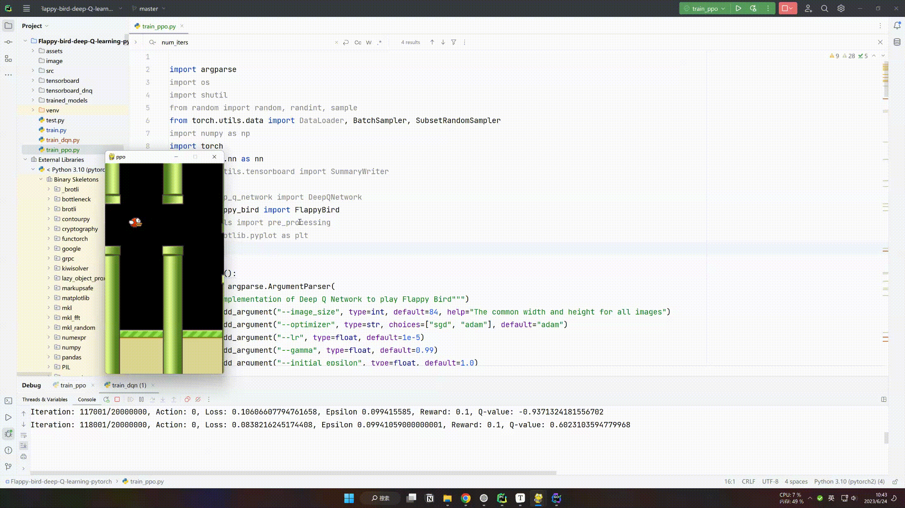
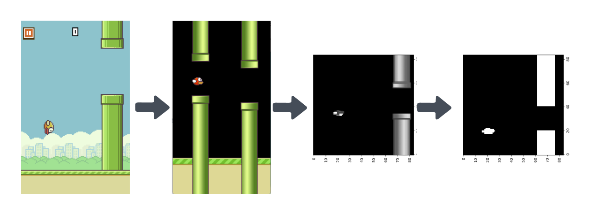
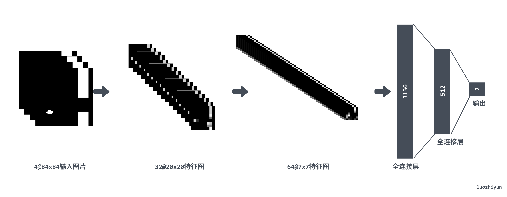
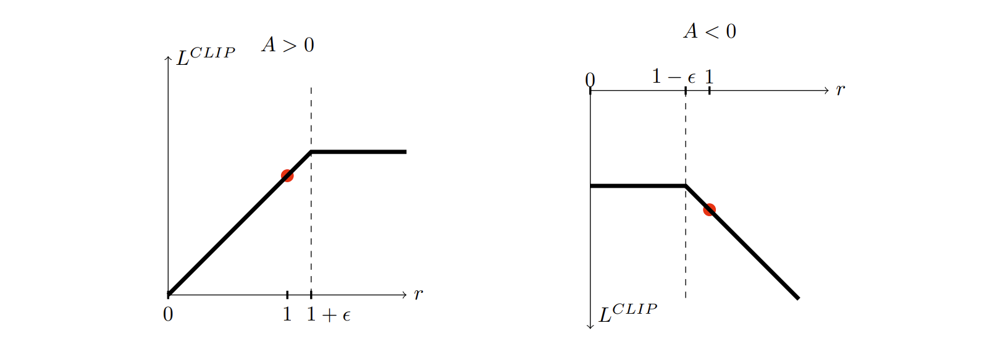

# 如何用 PPO 算法让 AI 学会玩 FlappyBird



本篇文章是一个强化学习的入门练手项目，在上一篇学习了强化学习的基础知识之后，这次我们来使用 CNN + PPO算法来实际让 AI 玩 FlappyBird 这款游戏。FlappyBird 是一款游戏，玩家控制的对象是游戏中的“小鸟”，在游戏运行瞬间有两个可以采取的动作：按下“上升”键，使得小鸟向上跳跃，而未按下任何按键时小鸟则以恒定速率下降。

那么为什么要选择这个游戏呢？一方面是它比较简单它有现成的环境可以使用，另一方面是它的环境都是基于 CNN 卷积神经网络识别图像来做强化学习。

CNN 卷积神经网络可以从原始像素中学习游戏的特性，并决定采取相应行动，这其实在强化学习中很常见，因为我们不总是能很好的直接通过数据描述游戏当前的状态，而通过图像可以让 AI 根据图像学习的话就可以简化状态特征描述这一过程。

所以我们设计的神经网络的功能就是提取游戏运行的图像，并输出从可采取的操作集合中提取的必要执行动作。然后执行游戏并基于所观察到的奖励来评价一个给定状态下的动作，以此来进行模型训练。

## 预处理

这里的预处理方式也是参照这篇论文所设置的：  http://cs229.stanford.edu/proj2015/362_report.pdf 。FlappyBird 原游戏输出的图像大小是 288x512 大小的，为了节省内存将其缩小为84×84大小的图像，然后将彩色图像转换为灰度图像，并使用阈值处理将灰度图像转换为二值图像。然后为了减少干扰去除背景层并用纯黑色背景代替，以去除噪声。



## 神经网络结构

因为使用 PPO 算法，它是基于 Actor-Critic 算法演变来的，所以需要两个网络 PolicyNet 和 ValueNet。这两个网络都是使用三层卷积层，加两层全连接层，只是 PolicyNet 返回的是一个动作概率列表，所以需要在输出层使用用 softmax 进行归一化处理。



所以 Policy Net 实现为：

```python
class PolicyNet(nn.Module):
    def __init__(self):
        super(PolicyNet, self).__init__()
        self.conv1 = nn.Sequential(nn.Conv2d(4, 32, kernel_size=8, stride=4), nn.ReLU())
        self.conv2 = nn.Sequential(nn.Conv2d(32, 64, kernel_size=4, stride=2), nn.ReLU())
        self.conv3 = nn.Sequential(nn.Conv2d(64, 64, kernel_size=3, stride=1), nn.ReLU())
        self.flat = nn.Flatten()
        self.fc1 = nn.Sequential(nn.Linear(7 * 7 * 64, 512), nn.Tanh())
        self.drop = nn.Dropout(0.5)
        self.fc3 = nn.Sequential(nn.Linear(512, 2)) 
    def forward(self, input):
        output = self.conv1(input)
        output = self.conv2(output)
        output = self.conv3(output)
        output = self.flat(output)
        output = self.drop(output)
        output = self.fc1(output)
        return nn.functional.softmax(self.fc3(output), dim=1)
```

其中在全连接层的位置加入了 Dropout 层防止过拟合。ValueNet 主要是输出一个价值 Value，要做的是通过 PolicyNet 与环境交互收集的数据学习一个价值函数，这个价值函数会用于判断在当前状态什么动作是好的，什么动作不是好的，进而帮助 PolicyNet 进行策略更新。

所以 PolicyNet 最后输出层是1 ：

```python
class ValueNet(nn.Module):
    def __init__(self):
        super(ValueNet, self).__init__()
        self.net = nn.Sequential(
            nn.Conv2d(4, 32, kernel_size=8, stride=4), nn.ReLU(),
            nn.Conv2d(32, 64, kernel_size=4, stride=2), nn.ReLU(),
            nn.Conv2d(64, 64, kernel_size=3, stride=1), nn.ReLU(),
            nn.Flatten(),
            nn.Linear(7 * 7 * 64, 512), nn.Tanh(),
            nn.Dropout(0.5),
            nn.Linear(512, 1),
        )

    def forward(self, input):
        return self.net(input)
```

## PPO（Proximal Policy Optimization）算法

PPO（Proximal Policy Optimization）是目前非常流行的增强学习算法，OpenAI把PPO作为目前的baseline算法，也就是说，OpenAI在做尝试的时候，首选PPO。可想而知，PPO可能不是目前最强的，但可能是目前来说适用性最广的一种算法。

### PPO 主要思想

PPO 是演变自 Actor-Critic 算法，所以 PPO 本质上是基于策略的算法。和  Actor-Critic 算法一样 ，PPO 算法中会使用两个网络，Policy Net 充当 Actor 输入为状态，输出为动作概率 $\pi(a|s)$ 。Value Net 充当 Critic ，输入为状态，输出为状态的价值。

- Actor 要做的是与环境交互，并在 Critic 价值函数的指导下用策略梯度学习一个更好的策略。
- Critic 要做的是通过 Actor 与环境交互收集的数据学习一个价值函数，这个价值函数会用于判断在当前状态什么动作是好的，什么动作不是好的，进而帮助 Actor 进行策略更新。

PPO 的想要通过限制在每个训练时期对策略的更新来提高策略的训练稳定性，希望避免过大的策略更新。因为根据经验，训练期间较小的策略更新更有可能收敛到最佳解决方案。所以 PPO 通过目前的策略和前一版的策略相比发生了多大的变化，并把比率裁剪层一个范围 `[1−ϵ,1+ϵ]`，让策略更新更保守。

在 REINFORCE 策略算法中它的目标函数通常是：
$$
L(\theta) = E_t[log\pi_{\theta}(a_t|s_t) * A_t]
$$
然后用这个函数做梯度上升方法来最大化这个目标函数，从而得到最优策略。但是它有两个问题，要么它的梯度太小，导致训练很慢；要么它梯度太大，导致数值的不稳定。所以 PPO 通过截断（Clip）的方式限制策略梯度的变化。
$$
L(\theta) = E_t[min(r_t(\theta)\hat{A_t}, clip(r_t(\theta),1-ϵ,1+ϵ)\hat{A_t})]
$$

其中 $r_t(\theta)$ 表示 Ratio Function，是用于计算新旧策略之间的比例，它的定义如下：
$$
r_t(\theta) = \frac{π_θ(a|s)}{π_{θ_old}(a|s)}
$$
其中，

- θ表示当前策略的参数
- $θ_{old}$表示旧的策略参数
- $π_θ(a|s)$表示在策略θ下，给定状态s时，选择动作a的概率
- $π_{θ_{old}}(a|s)$表示在旧的策略$θ_{old}$下，给定状态s时，选择动作a的概率

 Ratio Function 的值描述了新策略相对于旧策略采取某一特定动作的相对概率。在PPO算法中，我们希望新策略与旧策略保持一定的接近度，也就是 Ratio Function 的值应接近1。为了实现这一目标，PPO在优化目标函数中添加了一项以限制 Ratio Function 的值的范围，这就是PPO算法中著名的"clip"函数。

如果 `A > 0`，说明这个动作的价值高于平均，最大化这个式子会增大 $\frac{π_θ(a|s)}{π_{θ_old}(a|s)}$ ，但不会让其超过 `1+ϵ` 。反之，如果`A < 0`，最大化这个式子会减小 $\frac{π_θ(a|s)}{π_{θ_old}(a|s)}$ ，但不会让其超过 `1-ϵ` 。



通过clip函数，PPO避免了在策略更新时做出过大的改变，从而提高了训练的稳定性，这是PPO算法相对于传统的策略梯度方法如A3C、TRPO等的主要优势。


### 优势函数

PPO 也算是一种基于策略的算法，所以也会用到时序差分算法，时序差分算法用当前获得的奖励加上下一个状态的价值估计来作为在当前状态会获得的回报，即：
$$
V(s_t)\leftarrow V(s_t) + α(r_t+\gamma V(S_{t+1})-V(s_t))
$$
其中 $V(s_t) + α(r_t+\gamma V(S_{t+1})$ 通常被称为**时序差分**（temporal difference，TD）**误差**（error），时序差分算法将其与步长的乘积作为状态价值的更新量。 PPO 会使用 TD 误差去计算优势函数：
$$
\hat{A_t} = δ_t + (γλ)δ_{t+1} + ... + ... + (γλ)^{T-t+1}δ_{T-1} \\
where \qquad δ_t= V(s_t) + α(r_t+\gamma V(S_{t+1})
$$
具体代码实现如下：

```python
states, actions, rewards, dones, next_states = ...
with torch.no_grad():
    td_target = rewards + opt.gamma * critic(next_states) * (1 - dones)
    td_delta = td_target - critic(states) 
    advantage_list = []
    advantage = 0.0
    for delta in td_delta.detach().numpy()[::-1]:
        advantage = gamma * lmbda * advantage + delta
        advantage_list.append(advantage)
    advantage_list.reverse()
    
```

### 训练过程

PPO 算法的具体流程如下：

* for 序列 $e = 1 -> E$ do:
  * 用当前策略 $\pi_{\theta}$ 采样轨迹 `{s1,a1,r1,s2,a2,r2,..}`存入到 buffer 中；
  * 当 buffer 里面的数据量大于 batch_size 的时候进行策略更新；
    * 为每一步数据计算 $\hat{A_t} = δ_t + (γλ)δ_{t+1} + ... + ... + (γλ)^{T-t+1}δ_{T-1}$；
    * 为每一步计算 $ δ_t= V(s_t) + α(r_t+\gamma V(S_{t+1})$；
    * 进行 K 次循环更新策略：
      * 计算 ratio 函数 $\frac{π_θ(a|s)}{π_{θ_old}(a|s)}$；
      * 计算 clip 函数 $min(r_t(\theta)\hat{A_t}, clip(r_t(\theta),1-ϵ,1+ϵ)\hat{A_t})$;
      * 更新 actor loss；
      * 更新 critic loss；
  * 更新完后清理 buffer；

## 总结

本文尝试利用 CNN 卷积神经网络图像识别游戏界面，然后利用 PPO 算法进行最佳动作预测从而进行游戏。进行训练的时候遇到了许多问题学习了很多，比如一开始我是按照《 动手强化学习 https://hrl.boyuai.com/chapter/2/ppo%E7%AE%97%E6%B3%95》里面去写的代码，后面发现 bird 老是飞到天花板导致训练一晚上一个水管都过不去，所以后面在 reward 里面加上了一个参数，如果飞到天花板，那么 reward 减 1。第二个就是训练是在游戏结束的时候才开始训练，这样训练起来的效果很差，后面查了这篇资料https://iclr-blog-track.github.io/2022/03/25/ppo-implementation-details/》才知道不能这么写，应该设置一个固定长度的 buffer，固定每次训练的数据集长度，训练完之后清空掉 buffer。

看完之后不妨自己尝试一下，改成 PPO2，顺带说一下我也尝试了 DNQ 的版本，但是每次依然飞到天上去，感兴趣的童鞋不妨自己调一下参数。

## Reference

http://cs229.stanford.edu/proj2015/362_report.pdf

https://github.com/uvipen/Flappy-bird-deep-Q-learning-pytorch

https://www.bilibili.com/video/BV1XP4y1d7Bk?p=4&vd_source=f482469b15d60c5c26eb4833c6698cd5

http://zh.d2l.ai/chapter_convolutional-neural-networks/why-conv.html

https://zhuanlan.zhihu.com/p/512327050

https://github.com/Lizhi-sjtu/DRL-code-pytorch/blob/main/4.PPO-discrete/ppo_discrete.py

https://arxiv.org/pdf/1707.06347.pdf

https://huggingface.co/blog/deep-rl-ppo

https://zhuanlan.zhihu.com/p/631338315

https://iclr-blog-track.github.io/2022/03/25/ppo-implementation-details/

